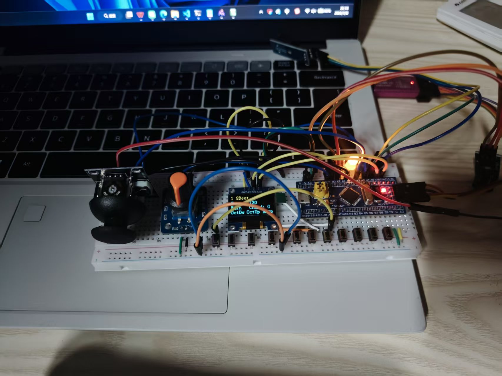
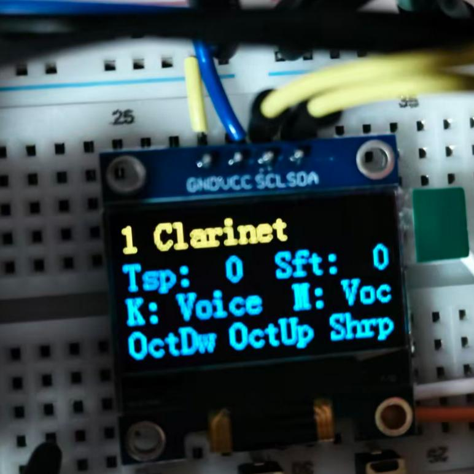
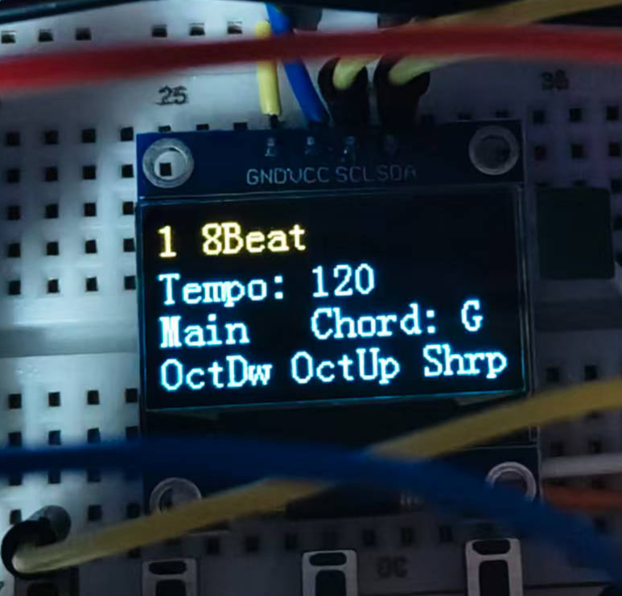

## 前言

大三下学期，我复刻了 B 站上一个 STM32 电子琴项目。学完标准外设库的 GPIO、定时器、ADC、中断之后，需要一个实际项目把它们串起来——电子琴恰好覆盖了输入（琴键、摇杆、旋钮）、输出（扬声器、OLED、LED）和实时响应（中断 + 主循环）。

成品有七个琴键、六种伴奏风格、五种旋律音色和九种打击乐音色，跑在 STM32F103C8T6 上。这篇文章记录我在复刻过程中理解到的核心技术——GPIO 引脚如何分配、PWM 如何发出不同频率的声音、中断如何响应按键、ADC 如何读取摇杆、编码器如何解码。

> 项目源码通过网盘分享：STM32电子琴
> 链接: https://pan.baidu.com/s/1HV2wewAkvmeZWxoOQ5VBFA?pwd=zx6b 提取码: zx6b

---

## 一、整体架构

### 1.1 硬件清单

| 外设 | 型号 | 数量 | 功能 |
|:---|:---|:---|:---|
| 主控 | STM32F103C8T6 | 1 | 72MHz Cortex-M3 |
| OLED 显示屏 | 0.96寸 4针 I2C (SSD1306) | 1 | 系统信息显示 |
| 无源蜂鸣器 | 小喇叭 | 2 | 双通道发声（旋律+伴奏） |
| 琴键 | 轻触按键 | 7 | 键盘弹奏输入 |
| 功能按键 | 轻触按键 | 4 | 八度/半音/编码器按键 |
| 旋转编码器 | EC11 | 1 | 参数调节旋钮 |
| PS2 摇杆模块 | 双轴电位器+按键 | 1 | 和弦选择+加花触发 |
| LED 指示灯 | 3mm 发光二极管 | 3 | 节拍/状态指示 |



### 1.2 软件分层

项目采用五层结构：

```
User 层 (main.c)             — 主程序逻辑，846 行
Hardware 层 (9 个模块)        — LED / Key / Buzzer / OLED / Encoder / Keyboard / AD / JoyStick
System 层 (Delay / PWM)       — SysTick 延时 + 双通道 PWM 驱动
Library 层                    — ST 标准外设库 V3.5.0
Start 层                      — CMSIS + 启动文件 + 时钟配置 (72MHz)
```

分层最直接的好处：换一个外设只改对应的 Hardware 文件，主逻辑不动。比如 OLED 从 I2C 换成 SPI，只改 `OLED.c`，`main.c` 一行不用动。

---

## 二、GPIO 引脚规划

这是项目落地的第一步——所有外设都要分配引脚。STM32F103C8T6 有 PA0~PA15、PB0~PB15 共 32 个 GPIO，需要考虑复用功能和 EXTI 线的限制。

### 2.1 完整引脚分配

**PWM 输出（复用推挽输出）**：

| 功能 | GPIO | 复用功能 | 说明 |
|:---|:---|:---|:---|
| 旋律扬声器 | PA0 | TIM2_CH1 | PWM 方波输出 |
| 伴奏扬声器 | PA7 | TIM3_CH2 | PWM 方波输出 |

**OLED 显示屏（开漏输出，软件模拟 I2C）**：

| 功能 | GPIO | 说明 |
|:---|:---|:---|
| OLED SCL | PC15 | I2C 时钟线 |
| OLED SDA | PC14 | I2C 数据线 |

**按键输入（下拉输入 + 外部中断）**：

| 功能 | GPIO | EXTI 线 | 说明 |
|:---|:---|:---|:---|
| 琴键 1（最低音） | PB12 | EXTI12 | 下降/上升沿双触发 |
| 琴键 2 | PB13 | EXTI13 | 同上 |
| 琴键 3 | PA8 | EXTI8 | 同上 |
| 琴键 4 | PA11 | EXTI11 | 同上 |
| 琴键 5 | PB3 | EXTI3 | 同上，需禁 JTAG |
| 琴键 6 | PB6 | EXTI6 | 同上 |
| 琴键 7（最高音） | PB9 | EXTI9 | 同上 |
| 降八度键 | PA10 | EXTI10 | 同上 |
| 升八度键 | PB15 | EXTI15 | 同上 |
| 升半音键 | PB14 | EXTI14 | 同上 |

**编码器输入（上拉输入 + 外部中断）**：

| 功能 | GPIO | EXTI 线 | 说明 |
|:---|:---|:---|:---|
| 编码器 A 相 | PB1 | EXTI1 | 仅下降沿触发 |
| 编码器 B 相 | PB0 | EXTI0 | 仅下降沿触发 |

**ADC 输入（模拟输入）**：

| 功能 | GPIO | ADC 通道 | 说明 |
|:---|:---|:---|:---|
| 摇杆 X 轴 | PA5 | ADC5 | 0~4095 |
| 摇杆 Y 轴 | PA3 | ADC3 | 0~4095 |

**LED 输出（推挽输出）**：

| 功能 | GPIO | 说明 |
|:---|:---|:---|
| LED 1（重拍） | PA6 | 共阳极，低电平亮 |
| LED 2 | PA4 | 同上 |
| LED 3 | PA3 | 同上 |

**其他数字输入**：

| 功能 | GPIO | 说明 |
|:---|:---|:---|
| 编码器按键 | PA9 | 下拉输入，轮询 |
| 摇杆 SW | PA1 | 上拉输入，轮询 |

### 2.2 两个踩坑点

**PB3 需要禁用 JTAG**。PB3 默认被 JTAG 占用（JTDO 功能），不能直接当 GPIO 用。必须先调用：

```c
GPIO_PinRemapConfig(GPIO_Remap_SWJ_JTAGDisable, ENABLE);
```

释放 PA15、PB3、PB4 之后，PB3 才能用作琴键 5 的输入。

**同一 EXTI 编号不能跨端口复用**。STM32F103 的 EXTI 控制器要求：EXTI3 只能接 PA3 或 PB3 或 PC3，不能同时接 PA3 和 PB3。所以分配引脚时，十个中断引脚必须各自使用不同的 EXTI 编号（0、1、3、6、8、9、10、11、12、13、14、15）。

---

## 三、PWM 如何发出声音

### 3.1 基本原理

无源蜂鸣器收到方波就会振动发声——频率决定音高，占空比决定音色。STM32 没有连接 DAC，但定时器的 PWM 输出本身就是方波：修改 PSC（预分频器）改变频率，修改 CCR（比较值）改变占空比。

PWM 频率公式：

```
Freq = 72000000 / ((PSC + 1) × (ARR + 1))
```

### 3.2 初始化配置

以旋律通道 TIM2_CH1（PA0）为例：

```c
void PWM_Init_1(void) {
    RCC_APB1PeriphClockCmd(RCC_APB1Periph_TIM2, ENABLE);
    RCC_APB2PeriphClockCmd(RCC_APB2Periph_GPIOA, ENABLE);

    // PA0 设为复用推挽输出
    GPIO_InitTypeDef GPIO_InitStructure;
    GPIO_InitStructure.GPIO_Mode = GPIO_Mode_AF_PP;
    GPIO_InitStructure.GPIO_Pin = GPIO_Pin_0;
    GPIO_InitStructure.GPIO_Speed = GPIO_Speed_50MHz;
    GPIO_Init(GPIOA, &GPIO_InitStructure);

    // 时基配置：向上计数，ARR=99，PSC=719，默认 1kHz
    TIM_TimeBaseInitTypeDef TIM_TimeBaseInitStructure;
    TIM_TimeBaseInitStructure.TIM_CounterMode = TIM_CounterMode_Up;
    TIM_TimeBaseInitStructure.TIM_Period = 100 - 1;       // ARR = 99
    TIM_TimeBaseInitStructure.TIM_Prescaler = 720 - 1;    // PSC = 719
    TIM_TimeBaseInitStructure.TIM_ClockDivision = TIM_CKD_DIV1;
    TIM_TimeBaseInit(TIM2, &TIM_TimeBaseInitStructure);

    // PWM 模式 1：CNT < CCR 时输出高电平
    TIM_OCInitTypeDef TIM_OCInitStructure;
    TIM_OCStructInit(&TIM_OCInitStructure);
    TIM_OCInitStructure.TIM_OCMode = TIM_OCMode_PWM1;
    TIM_OCInitStructure.TIM_OCPolarity = TIM_OCPolarity_High;
    TIM_OCInitStructure.TIM_OutputState = TIM_OutputState_Enable;
    TIM_OCInitStructure.TIM_Pulse = 0;   // CCR = 0，初始静音
    TIM_OC1Init(TIM2, &TIM_OCInitStructure);

    TIM_Cmd(TIM2, ENABLE);
}
```

伴奏通道 TIM3_CH2（PA7）的初始化完全对称，只把 TIM2 换成 TIM3、通道 1 换成通道 2。

### 3.3 调频技巧：固定 ARR，只改 PSC

这个项目最巧妙的设计决策是 **ARR 始终为 99，通过 PSC 调节频率**：

```c
void PWM_SetFreq_1(uint16_t freq) {
    uint16_t psc = 720000 / freq - 1;
    TIM_PrescalerConfig(TIM2, psc, TIM_PSCReloadMode_Update);
}

void PWM_SetDuty_1(uint16_t duty) {
    TIM_SetCompare1(TIM2, duty);   // duty 范围 0~100
}
```

这样做有两个好处：

1. **占空比精度恒定 1%**。CCR 始终在 0~100 之间，设 50 就一定是 50%，不管当前频率是多少
2. **计算简单**。只需要一行 `PSC = 720000 / freq - 1`，ARR 根本不用管

如果反过来（固定 PSC 改 ARR），每次调频都要重新算占空比，而且 ARR 越小占空比分辨率越低。

### 3.4 频率-预分频对照

| 目标频率 | PSC 值 | 实际频率 |
|:---|:---|:---|
| 262Hz (C4) | 2747 | 261.8Hz |
| 440Hz (A4) | 1635 | 440.3Hz |
| 1000Hz | 719 | 1000Hz |
| 3000Hz | 239 | 3000Hz |

3000Hz 以下精度优于 0.1%，对电子琴来说完全够用。

### 3.5 双通道独立控制

两个通道各自独立调频，上层 Buzzer 模块用 `channel` 参数统一接口：

```c
void Buzzer_ON(uint16_t freq, uint8_t tone, uint8_t channel) {
    if (channel == 1) {        // 旋律通道 → TIM2_CH1 → PA0
        PWM_SetFreq_1(freq);
        PWM_SetDuty_1(tone);
    } else if (channel == 2) { // 伴奏通道 → TIM3_CH2 → PA7
        PWM_SetFreq_2(freq);
        PWM_SetDuty_2(tone);
    }
}

void Buzzer_Timing(uint16_t freq, uint16_t timing,
                   uint8_t tone, uint8_t channel) {
    Buzzer_ON(freq, tone, channel);
    Delay_ms(timing);
    Buzzer_OFF(channel);
}
```

`Buzzer_OFF` 的实现不是停定时器，而是把占空比设为 0——输出恒低，扬声器不出声，但定时器仍在后台运行。

### 3.6 Buzzer_Reset：消除音头杂音

切换音符时，如果上一个方波的正半周期还没结束，新音符的第一个周期可能被截断，产生"咔嗒"声。解决方法是发声前把计数器强制设为 51（接近 ARR=99）：

```c
void Buzzer_Reset(uint8_t channel) {
    PWM_SetFreq_1(1);
    TIM_SetCounter(TIM2, 51);   // CNT 跳到接近 ARR
}
```

计数器接近溢出点，下一个 PWM 边沿几微秒内就会到来——音头平滑，没有杂音。

---

## 四、从按键到音高：中断发声的完整链路

### 4.1 EXTI 中断分布

10 个按键引脚分布在 5 条 EXTI 中断线上。因为 STM32F103 同一编号的 EXTI 线只能接一个端口，所以 10 个按键必须用 10 个不同的 EXTI 编号：

| 中断向量 | 覆盖引脚 | 功能 |
|:---|:---|:---|
| EXTI0 | PB0 | 编码器 B 相（仅下降沿） |
| EXTI1 | PB1 | 编码器 A 相（仅下降沿） |
| EXTI3 | PB3 | 琴键 5 |
| EXTI9_5 | PA8, PB6, PB9 | 琴键 3/6/7 |
| EXTI15_10 | PA10, PA11, PB12~PB15 | 琴键 1/2/4 + 三个功能键 |

编码器只触发下降沿（检测旋转方向），琴键和功能键触发上升和下降沿（检测按下和松开）。

### 4.2 中断优先级

使用 NVIC_PriorityGroup_2（2 位抢占 + 2 位响应）：

```
编码器 EXTI0/EXTI1: 抢占=1   ← 最高优先，确保旋钮不丢步
琴键 EXTI3/9_5/15_10: 抢占=2 ← 仍能打断主循环
```

编码器每转动一个齿产生一个脉冲。如果中断被延迟到下一个脉冲之后，方向判断就会出错。抢占优先级设为 1 保证了它不被任何琴键中断阻塞。

### 4.3 琴键发声的完整流程

以琴键 5（PB3）为例，整个链路是：

```c
void EXTI3_IRQHandler(void) {
    if (EXTI_GetITStatus(EXTI_Line3) == SET) {
        if (GPIO_ReadInputDataBit(GPIOB, GPIO_Pin_3) == 1) {
            // ===== 按下琴键 =====
            if (voice == 6) {
                Buzzer_Drum(5);         // 鼓组模式：琴键变打击垫
            } else {
                Buzzer_Reset(1);        // ① 平滑音头
                uint16_t freq = scale[4 + sft]      // ② 查音阶表
                              * transpose[tsp]       // ③ 移调系数
                              * pow(2, oct)          // ④ 八度倍率
                              * pow(1.06, sharp);    // ⑤ 升半音
                Buzzer_ON(freq, voiceDuties[voice - 1], 1);  // ⑥ 发声
            }
        } else {
            // ===== 松开琴键 =====
            Buzzer_OFF(1);              // 立即静音
        }
        EXTI_ClearITPendingBit(EXTI_Line3);
    }
}
```

频率计算的五个环节各司其职：

| 步骤 | 变量 | 作用 | 示例 |
|:---|:---|:---|:---|
| 音阶表 | `scale[]` | 13 个音阶的固定频率 G3~E5 | `scale[4] = 294Hz` (D4) |
| 键盘平移 | `sft` (0~6) | 七个琴键整体向右平移 | sft=0 时琴键1=G3, sft=3 时琴键1=C4 |
| 移调 | `transpose[tsp]` | 全局升/降调 | tsp=5 时 ×1.0 不移调 |
| 八度 | `pow(2, oct)` | oct=0 低八度(×1), oct=1 正常(×2), oct=2 高八度(×4) |  |
| 半音 | `pow(1.06, sharp)` | sharp=1 时 ×1.06≈升半音 |  |

七个琴键各自的 ISR 代码结构完全一致，区别只在 `scale[]` 的索引偏移（琴键 1 取 `scale[0+sft]`，琴键 7 取 `scale[6+sft]`）。

### 4.4 功能键：按住就生效，松开就恢复

三个功能键用了上升/下降沿双触发——同一个中断在按下和松开时各触发一次，直接读电平判断状态：

```c
// 降八度键 (PA10)
if (GPIO_ReadInputDataBit(GPIOA, GPIO_Pin_10) == 1)
    oct = 0;    // 按住 → 低八度
else
    oct = 1;    // 松开 → 恢复正常
```

比「按一下锁存、再按一下取消」的方案更顺手——手一松就回原音高，不需要低头看状态。

---

## 五、ADC 采样：PS2 摇杆读方向

摇杆 X/Y 轴是电位器输出，电压随摇杆位置变化。STM32 的 12 位 ADC 把电压转为 0~4095 的数字量。

### 5.1 ADC 初始化

```c
void AD_Init(uint16_t pins) {
    // GPIO 模拟输入
    // ADC1 独立模式，软件触发，单次转换，右对齐
    // 采样时间 55.5 个 ADC 时钟周期
    // ADC 时钟 = PCLK2 / 6 = 12MHz
}
```

```c
uint16_t AD_GetValue(uint8_t ADC_Channel) {
    ADC_RegularChannelConfig(ADC1, ADC_Channel, 1, ADC_SampleTime_55Cycles5);
    ADC_SoftwareStartConvCmd(ADC1, ENABLE);            // 启动转换
    while (ADC_GetFlagStatus(ADC1, ADC_FLAG_EOC) == RESET); // 等待完成
    return ADC_GetConversionValue(ADC1);               // 返回 0~4095
}
```

每次调用 `AD_GetValue` 会切换通道、触发一次转换、轮询等待 EOC 标志位。这是最简单的 ADC 用法——不需要 DMA，不需要连续模式，适合摇杆这种低频采样的场景。

### 5.2 用阈值判断方向

摇杆 X/Y 各返回 0~4095 的值。用 1024 和 3072 两个阈值把每个轴分成三档：

```
Y < 1024  → 上
Y > 3072  → 下
X < 1024  → 左
X > 3072  → 右
其他     → 中间（死区）
```

X 和 Y 组合起来就是八个方向加一个中间位置，依次映射到不同的功能。中间位置设了一个较大的死区（1024~3072），防止摇杆回中时的抖动导致状态来回跳。

---

## 六、EC11 旋转编码器

### 6.1 硬件接口

EC11 有三个引脚——A 相、B 相和一个按键。A/B 相内部是机械触点，旋转时两路输出 90° 相位差的脉冲。正转时 A 超前 B，反转时 B 超前 A。

STM32 端配置为内部上拉输入（IPU），编码器另一侧接地——不转时读到高电平，转动接地瞬间读到低电平（下降沿）。

### 6.2 方向解码

A 相下降沿触发时读 B 相，B 相下降沿触发时读 A 相：

```c
void EXTI0_IRQHandler(void) {  // B 相下降沿
    if (EXTI_GetITStatus(EXTI_Line0) == SET) {
        if (GPIO_ReadInputDataBit(GPIOB, GPIO_Pin_1) == 0)
            Encoder_Count = 1;    // B 降沿时 A=0 → 正转
        EXTI_ClearITPendingBit(EXTI_Line0);
    }
}

void EXTI1_IRQHandler(void) {  // A 相下降沿
    if (EXTI_GetITStatus(EXTI_Line1) == SET) {
        if (GPIO_ReadInputDataBit(GPIOB, GPIO_Pin_0) == 0)
            Encoder_Count = -1;   // A 降沿时 B=0 → 反转
        EXTI_ClearITPendingBit(EXTI_Line1);
    }
}
```

逻辑很简单：在每相的下降沿看一眼另一相的电平。正转时 A 先下降（B 还是低），反转时 B 先下降（A 还是低）。

### 6.3 通用的参数调节接口

`Encoder_Var()` 封装了「旋转编码器改一个变量的值」的全部逻辑：

```c
int16_t Encoder_Var(int16_t var, int8_t step,
                    int16_t min, int16_t max,
                    int16_t setL, int16_t setH) {
    var += Encoder_Get() * step;   // 累加旋转量
    if (var > max) var = setH;     // 超上限 → 跳转到 setH
    else if (var < min) var = setL; // 超下限 → 跳转到 setL
    Encoder_Clear();
    return var;
}
```

同一个函数覆盖了所有旋钮调节场景——切音色（1→6→1 循环）、调速度（40→240 钳制）、移调（-5→+6 钳制）——全靠参数组合实现。

---

## 七、音色变化与打击乐：PWM 占空比 + 频率控制

这部分我没有从头设计，直接沿用了原项目的方案，但理解了原理。

### 7.1 五种旋律音色

五种音色完全通过 PWM 占空比区分。不同占空比的方波谐波成分不同，人耳听起来就是不同的音色：

```c
uint8_t voiceDuties[5] = {50, 40, 30, 20, 10};
```

| 占空比 | 对应的音色 |
|:---|:---|
| 50% | 单簧管 (Clarinet) |
| 40% | 管风琴 (Pipe Organ) |
| 30% | 手风琴 (Accordion) |
| 20% | 双簧管 (Oboe) |
| 10% | 小号 (Trumpet) |

### 7.2 九种打击乐音色

打击乐没有固定频率，发声短暂且有变化。九种音色用三种代码技法模拟：

**固定频率短脉冲**（低音鼓、踩镲、Agogo）：

```c
Buzzer_Timing(80, 30, 50, 2);   // 80Hz 持续 30ms → 低音鼓
Buzzer_Timing(3000, 30, 10, 2); // 3000Hz 持续 30ms → 踩镲闭合
```

**频率扫频**（通鼓高/中/低）——频率逐步下降，模拟鼓面被敲击后音调下沉：

```c
for (int i = 500; i > 470; i--) {
    Buzzer_ON(i, 50, 2);
    Delay_ms(1);
}
```

**两个频率交替振荡**（小军鼓）——600Hz 和 1200Hz 快速切换，制造沙沙的噪声感：

```c
for (int i = 0; i < 15; i++) {
    Buzzer_ON(600, 50, 2);  Delay_ms(1);
    Buzzer_ON(1200, 30, 2); Delay_ms(1);
}
```

---

## 八、主程序：双模式循环

`main()` 初始化所有外设后进入死循环，根据 `mode` 变量在两个模式间切换。

### 8.1 初始化阶段

```c
int main(void) {
    LED_Init_A(LED1 | LED2 | LED3);  // 3 颗 LED
    Key_Init_A(Key1 | Key4);         // 2 个按键 (PA)
    Key_Init_B(Key2 | Key3);         // 2 个按键 (PB)
    Buzzer_Init();                   // 双通道 PWM
    OLED_Init();                     // I2C OLED（现成驱动）
    Encoder_Init();                  // EC11 编码器
    Keyboard_Init();                 // 7 琴键 EXTI 中断
    JoyStick_Init();                 // PS2 摇杆 ADC + SW

    while (1) { /* 主循环 */ }
}
```

`Keyboard_Init()` 内部做了 GPIO、EXTI、NVIC 三步配置，`JoyStick_Init()` 调用 `AD_Init()` 配置两个 ADC 通道。

### 8.2 模式切换

摇杆 SW 按下时在两个模式间切换：

```
音色模式 (mode=1) ←→ 伴奏模式 (mode=2)
```

切换时 `OLED_Clear()` 清屏，`knob` 重置为 1。

### 8.3 旋钮复用

编码器只有一个，但两个模式各需要调节三种参数。解决方案是 Key4 切换 `knob` 变量，编码器根据 `knob` 操作不同参数：

| 模式 | knob=1 | knob=2 | knob=3 |
|:---|:---|:---|:---|
| 音色模式 | 切换音色 (1~6) | 移调 (-5~+6) | 键盘平移 (-3~+3) |
| 伴奏模式 | 切换风格 (1~6) | 调节速度 (40~240) | 琶音音色 (1~5) |

所有调节都通过同一个 `Encoder_Var()` 函数完成，只是参数不同。

### 8.4 OLED 显示效果

音色模式下 OLED 的实际显示：



伴奏模式下 OLED 的实际显示：



---

## 九、自动伴奏的实现思路

伴奏引擎我没有从零设计，但梳理了它的工作方式。核心是把「一段伴奏」拆成一组数组：

| 数组 | 作用 |
|:---|:---|
| 琶音轨 | 每个位置放一个和弦音序号，0 表示休止 |
| 鼓轨 1/2 | 每个位置放打击乐类型编号 |
| 加花轨 | 触发加花时替代正常鼓轨 |

播放时用 `for` 循环遍历数组，每个位置依次发声然后 Delay 一个固定的时长。这个时长由 BPM（速度）决定——比如 120BPM 的 8Beat，每拍 `30000 / 120 = 250ms`。

每种风格（8Beat / 16Beat / Waltz / Swing / March / Slow Rock）就是一套不同的数组，总共不到 500 字节。

播放过程中每拍检查一次摇杆和按键——摇杆切换和弦、SW 触发加花、编码器调节速度、Key4 停止。整个伴奏就是一个「数组遍历 + 延时 + 检测输入」的大循环。

---

## 十、总结

这个复刻项目让我把 STM32 的几个核心外设完整跑了一遍：

| 技术点 | 具体应用 |
|:---|:---|
| **GPIO** | 四种模式：复用推挽(PWM)、开漏(I2C)、下拉输入(按键)、推挽输出(LED) |
| **定时器 PWM** | 双通道独立调频/调占空比，ARR 固定 + PSC 变频率 |
| **外部中断 EXTI** | 10 个引脚分布在 5 条中断线上，编码器独占最高优先级 |
| **ADC** | 单通道轮流采样，阈值分割判断摇杆方向 |
| **SysTick 延时** | 微秒/毫秒/秒三级延时，伴奏节拍的时间基准 |
| **编码器解码** | A/B 相下降沿互读判断方向 |

最大的收获不是学会了某个具体技术，而是体会到一个完整的嵌入式项目怎么把 GPIO、PWM、中断这些独立的概念串在一起——程序启动 → 初始化所有外设 → 主循环轮询编码器和按键 → 中断响应琴键 → ADC 读取摇杆 → PWM 输出声音。每一个环节都在和其他环节配合。
