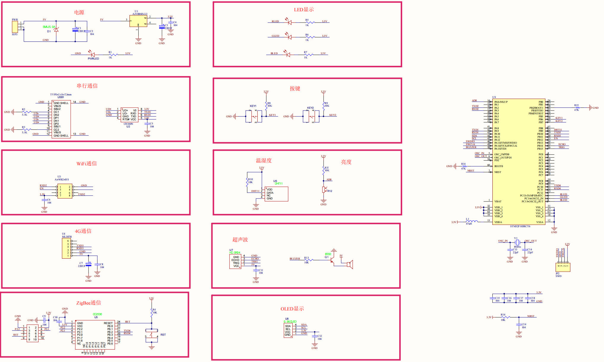
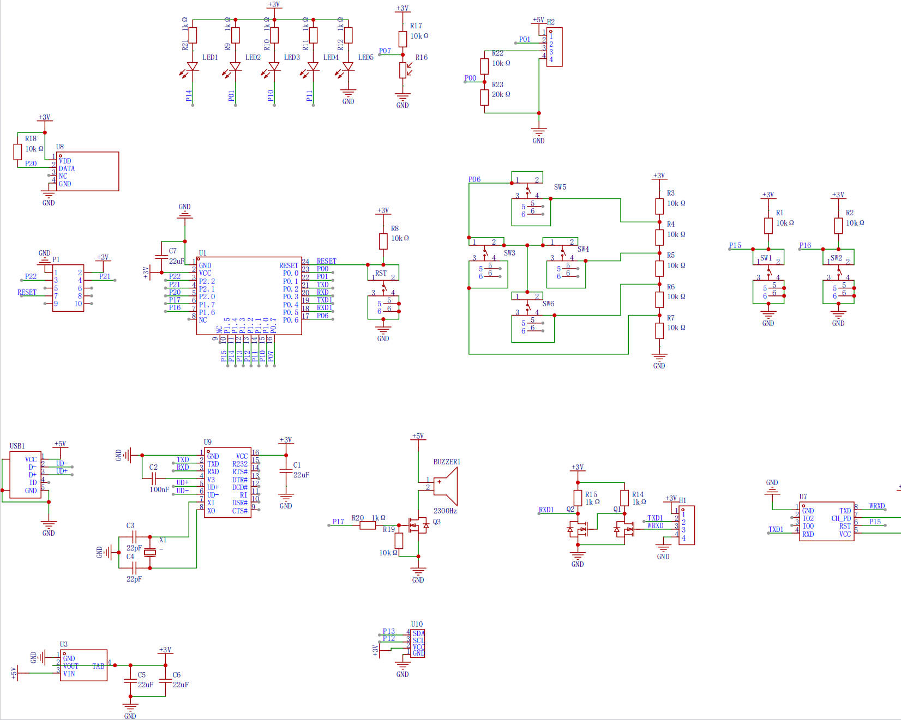
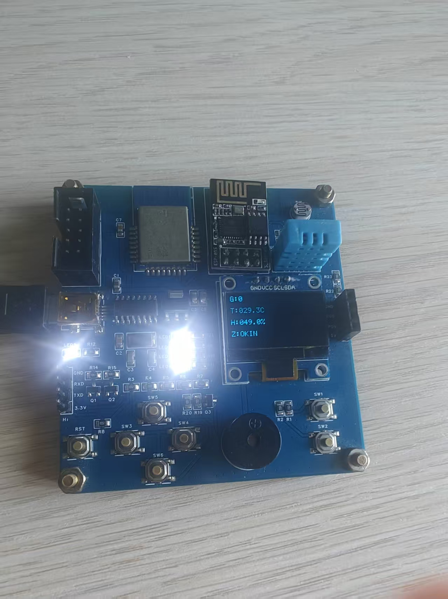
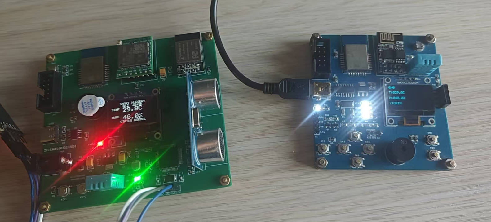
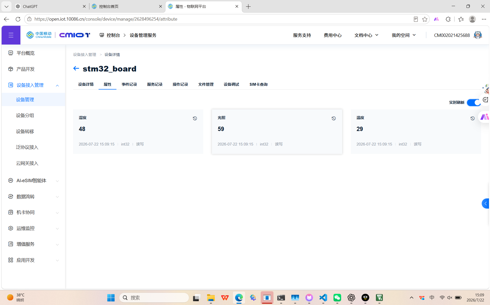
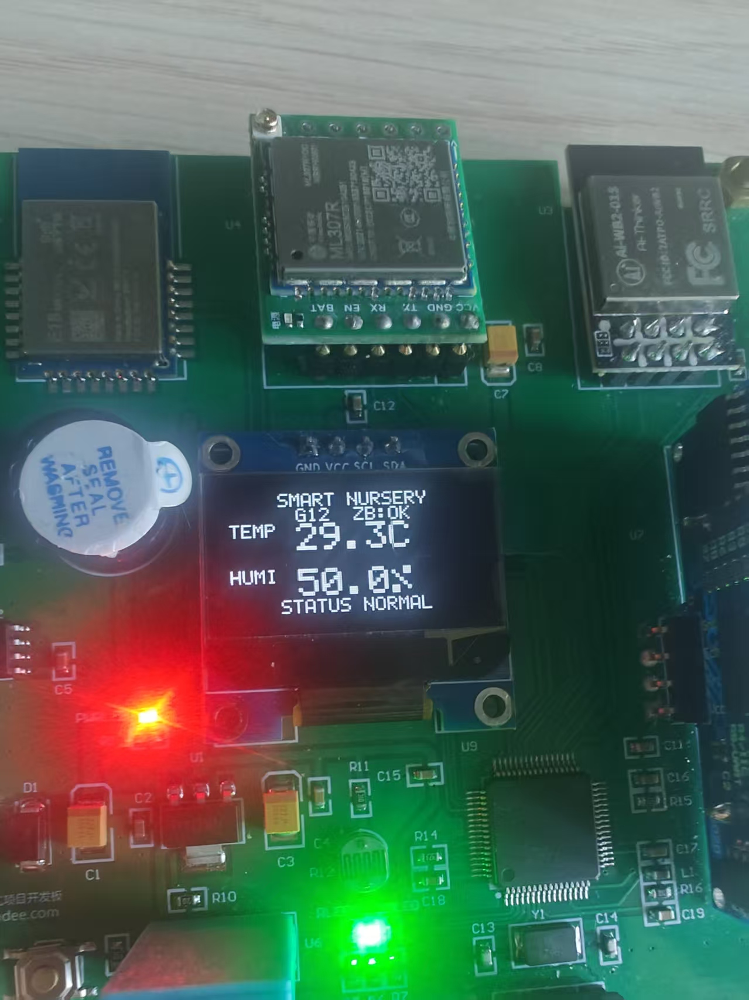
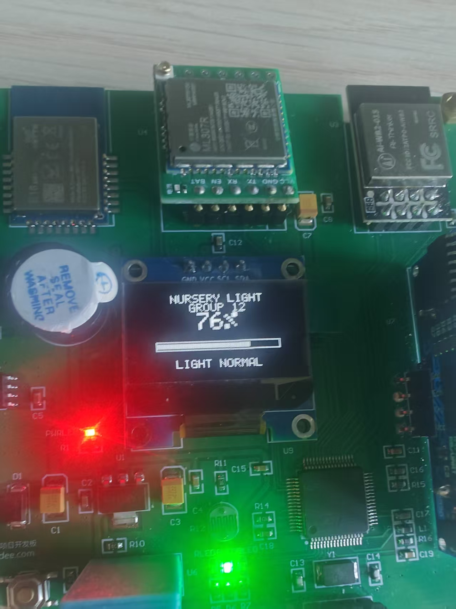
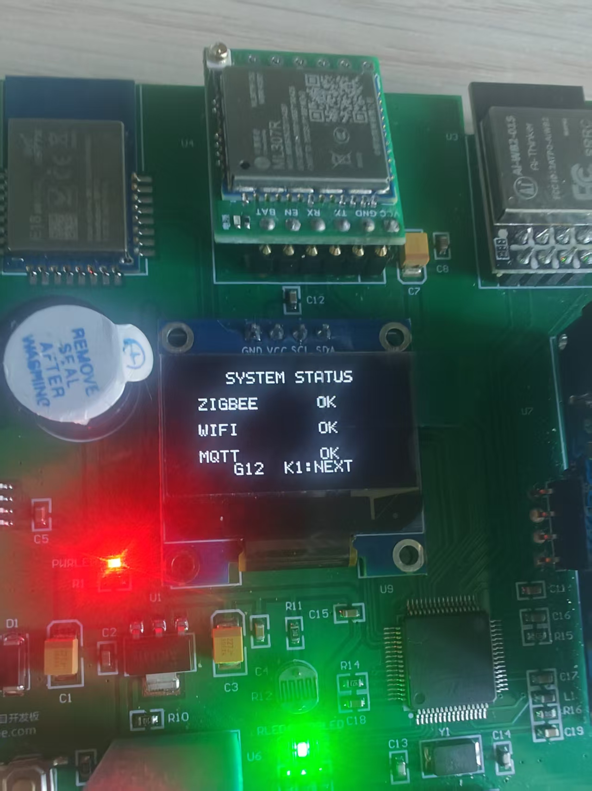

## 前言

大三暑假，我在成都琢朴科技有限公司参加了为期两周的实训。实训任务是搭建一个物联网数据采集系统：CC2530 开发板采集温湿度，通过 Zigbee 无线通信传给 STM32 网关，STM32 再通过 Ai-WB2-01S WiFi 模块把数据上传到 OneNET 云平台。

项目分两个阶段推进。第一阶段先搞定 STM32 单板上云——本地采集传感器数据，直接通过 WiFi 模块推到云端，把整条"传感器 → STM32 → MQTT → 云平台"的链路跑通。第二阶段加入 Zigbee 无线通信——传感器移到独立的 CC2530 板子上，通过 Zigbee 网络把数据传到 STM32 板载的另一颗 CC2530，再由 STM32 上云，实现真正的"采集端无线化"。

这篇文章记录的是最终版方案——两块 CC2530 之间 Zigbee 通信、CC2530 到 STM32 的 UART 帧协议、Ai-WB2-01S 的 AT 指令控制、以及面向 OneNET 的 MQTT 报文手写。

---

## 一、系统总览

### 1.1 硬件拓扑

系统由三部分组成：

**采集端 — CC2530 开发板（Sensor Router）**

| 组件 | 说明 |
|:---|:---|
| 主控 | CC2530（Zigbee Router，持续供电） |
| 传感器 | 板载 DHT11 温湿度 |
| 显示 | I2C OLED（SCL=P1.2, SDA=P1.3） |
| 无线 | 2.4GHz Zigbee，信道 15 |

**网关端 — STM32F103RCT6 大板**

| 组件 | 连接 | 说明 |
|:---|:---|:---|
| 板载 CC2530 | PC10/PC11 → UART4 | Zigbee Coordinator，收无线数据后通过 UART 转发 |
| Ai-WB2-01S | PA2/PA3 → USART2 | WiFi/BLE 模组，AT 指令控制，TCP Socket 上云 |
| OLED | I2C | 三页显示（温湿度 / 光照 / 网络状态） |
| 光敏电阻 | PA0 → ADC | 本地采集，不经过 Zigbee |
| LED ×3 | PC13/PC14/PC15 | 状态指示灯 |

**云平台 — OneNET**

接收 MQTT 上报的 `Temperature`、`Humidity`、`Light` 三个属性，支持数据可视化和远程下发。

### 1.2 数据流向

数据从采集到上云经过 6 个环节，每一层都有独立的校验：

| 步骤 | 环节 | 校验方式 |
|:---|:---|:---|
| 1 | DHT11 → CC2530 Sensor | DHT11 校验和 |
| 2 | Sensor → Zigbee 空中 → Coordinator | Zigbee MAC 层链路校验 |
| 3 | Coordinator → UART4 → STM32 | 16 字节帧：AA55 帧头 + CRC16 |
| 4 | STM32 帧解析 → 数据快照 | 量程校验 + 时效检测（5 秒超时） |
| 5 | 快照 → MQTT PUBLISH → Ai-WB2 | CONNACK 返回码检查 |
| 6 | Ai-WB2 → TCP → OneNET | TCP 层保证可靠传输 |

任意一步出错都有独立的状态标志，联调时看一眼就知道该查哪一层。

---

## 二、第一阶段：STM32 单板上云

先做减法——不碰 Zigbee，让 STM32 本地采集传感器，通过 Ai-WB2-01S 直接上云。目的是先把 STM32 ↔ WiFi 模块 ↔ MQTT ↔ OneNET 这条链路打通。

### 2.1 硬件连接

STM32 板上自带 DHT11 温湿度传感器和 HC-SR04 超声波测距模块，WiFi 模块通过 USART2（PA2/PA3）与 STM32 通信。



### 2.2 WiFi AT 指令控制

Ai-WB2-01S 是一个 Combo-AT 固件的 WiFi/BLE 模组，对外通过 AT 指令控制。核心操作都是一问一答的模式：发命令 → 等 OK / ERROR / 超时。

```c
// 发送 AT 指令并等待期望的响应
static WiFiResult_t WiFi_SendCmd(const char *cmd, uint32_t timeout_ms) {
    WiFi_SendAT(cmd);           // 清缓冲 → 发送命令 + \r\n
    Delay_ms(50);               // 跳过回显
    return WiFi_WaitResponse("OK", timeout_ms);
}
```

连接 WiFi 的流程：

```c
// 1. 设置 Station 模式
AT+CWMODE=1         // ESP-AT 风格，或者
AT+WMODE=1,1        // Combo-AT 风格

// 2. 连接热点
AT+CWJAP="SSID","PASSWORD"     // ESP-AT
AT+WJAP="SSID","PASSWORD"      // Combo-AT

// 3. 等待 DHCP 获取 IP
AT+CIFSR             // 查询 IP
```

实际代码做了两种 AT 指令集的兼容——先用 ESP-AT 尝试，失败自动切换到 Combo-AT。因为在不同批次的 Ai-WB2 模组上，固件版本不一样，指令集也有差别。

### 2.3 MQTT 报文手写

OneNET 的 Token 认证方式要求 MQTT CONNECT 报文的 Password 字段携带完整的 Token 字符串——而这个 Token 通常超过 63 字节，超出了 Ai-WB2 原生 `AT+MQTT=6,password` 的单参数长度限制。

解决方案是放弃模组自带的 MQTT AT 指令，通过 TCP Socket 手写 MQTT 报文：

**Step 1：打开 TCP Socket**

```
AT+SOCKET=4,stD90eAGnR.mqtts.acc.cmcconenet.cn,1883
```

响应中包含 `ConID=N`，记下这个 Socket ID，后续发送数据全靠它。

**Step 2：手写 CONNECT 报文**

```
固定头: 0x10
剩余长度: 变长编码
可变头: 协议名"MQTT" + 协议级别4 + 连接标志0xC2 + KeepAlive 60s
Payload: ClientID + Username(产品ID) + Password(Token)
```

```c
// 关键代码：动态构建 CONNECT 包
static WiFiResult_t MQTT_BuildConnectPacket(uint8_t *pkt, uint16_t pkt_size,
                                            const char *cid,
                                            const char *user,
                                            const char *pass,
                                            uint16_t *out_len) {
    uint8_t *p = pkt;
    *p++ = 0x10;                    // 固定头
    p += MQTT_EncodeRemainingLength(p, rem_len);
    *p++ = 0x00; *p++ = 0x04;
    memcpy(p, "MQTT", 4); p += 4;
    *p++ = 0x04;                    // MQTT 3.1.1
    *p++ = 0xC2;                    // clean session + username + password
    *p++ = 0x00; *p++ = 0x3C;       // Keep Alive 60s
    p = MQTT_WriteString(p, cid);   // Client ID
    p = MQTT_WriteString(p, user);  // Username = 产品 ID
    p = MQTT_WriteString(p, pass);  // Password = Token
    *out_len = (uint16_t)(p - pkt);
}
```

**Step 3：发送二进制包**

`AT+SOCKETSEND=<ConID>,<length>` → 等 `>` 提示符 → 发送 MQTT 二进制包 → 等 `OK`

**Step 4：接收 CONNACK**

`AT+SOCKETREAD=<ConID>` → 解析返回的 `+SOCKETREAD:` 事件 → 检查 CONNACK 返回码是否为 0（认证成功）

### 2.4 数据上报

连接到 OneNET 后，每 5 秒构造一条 JSON 通过 `AT+SOCKETSEND` 发出：

```json
{
  "id": "1",
  "params": {
    "Temperature": {"value": 26},
    "Humidity": {"value": 58},
    "Distance": {"value": 12.3}
  }
}
```

### 2.5 云端下发控制

OneNET 支持云端下发属性设置命令，设备需要订阅对应的 Topic 并解析下行的 MQTT PUBLISH 包。第一阶段额外实现了云端远程控制板载 LED 和蜂鸣器的功能——收到 `{"LED":{"value":true}}` 就点亮 LED，做到了双向通信。

---

## 三、第二阶段：Zigbee 无线传感网

单板上云跑通后，实训任务进入核心部分——把传感器从 STM32 板上"拆"出来，放到独立的 CC2530 开发板上，通过 Zigbee 无线网络传回数据。

### 3.1 两颗 CC2530 的分工

| 角色 | 位置 | 职责 |
|:---|:---|:---|
| **Sensor Router** | 独立 CC2530 开发板 | 读 DHT11 → OLED 本地显示 → Zigbee 每 2 秒发一帧 |
| **Coordinator Bridge** | STM32 大板上 U5 位置 | 建网 → 收 Zigbee 帧 → UART4 转成 16 字节帧发 STM32 |

Sensor 端的 CC2530 作为 Zigbee Router（持续供电，不做休眠），Coordinator 端也是持续运行。两端都固定 Zigbee 信道 15，Coordinator 自动建网并开放加入，Router 失败时每 5 秒自动重试，不需要手动按配网键。





### 3.2 Zigbee 应用层协议：10 字节紧凑负载

空中只传 10 字节业务数据（Zigbee MAC 层自带链路校验，不需要在应用层再做）：

| 偏移 | 长度 | 字段 | 说明 |
|:---|:---|:---|:---|
| 0 | 1 | message_type | `0x01` = 传感报告 |
| 1 | 1 | group_id | 固定 `0`（内部组号） |
| 2 | 2 | sequence | 每包加 1，溢出回绕 |
| 4 | 2 | temperature_x10 | 有符号小端，253 表示 25.3℃ |
| 6 | 2 | humidity_x10 | 小端，603 表示 60.3% |
| 8 | 1 | sensor_status | bit0 = DHT11 读取出错 |
| 9 | 1 | zigbee_lqi | Sensor 端填 0，Coordinator 替换为收到时的链路质量 |

所有多字节字段用小端序，这是 Zigbee 网络字节序的惯例。

### 3.3 CC2530 → STM32 UART 帧协议：16 字节带 CRC

裸 UART 没有链路校验——STM32 和 CC2530 之间可能在复位或干扰时错位。所以 Coordinator 在 Zigbee 负载外面包了一层帧结构：

```
AA 55 | version | length | payload[10] | CRC16_H | CRC16_L
```

- 帧头 `AA 55`：两个字节，同步用
- `version`：`0x01`，协议版本
- `length`：固定 `0x0A`（10 字节 payload）
- `payload`：跟 Zigbee 空中负载完全一致的 10 字节
- CRC16：CRC16-CCITT-FALSE（初值 `0xFFFF`，多项式 `0x1021`），覆盖 `version + length + payload`

固定测试向量确保双方解析一致——温度 25.3℃、湿度 60.0%、序号 1、LQI 200，整帧为：

```
AA 55 01 0A 01 00 01 00 FD 00 58 02 00 C8 B4 04
```

其中 CRC 应为 `0xB404`。这个测试向量可以在 Coordinator 侧和 STM32 侧分别验证，避免"两边看着都对、接在一起不通"。

### 3.4 STM32 侧的帧解析状态机

STM32 的 UART4 接收 CC2530 发来的字节流，用一个有限状态机逐字节解析：

```c
typedef enum {
    PARSER_WAIT_SOF1,   // 等 0xAA
    PARSER_WAIT_SOF2,   // 等 0x55
    PARSER_VERSION,     // 读版本号
    PARSER_LENGTH,      // 读长度
    PARSER_PAYLOAD,     // 收 10 字节负载
    PARSER_CRC_HIGH,    // CRC 高字节
    PARSER_CRC_LOW      // CRC 低字节，校验通过则存入快照
} parser_state_t;
```

设计要点：

1. **SOF1/SOF2 的恢复逻辑**：如果在 `PARSER_WAIT_SOF2` 收到一个不是 `0x55` 的字节，不是直接回 `WAIT_SOF1`，而是检查它本身是不是一个新的 `0xAA`——这样可以避免因一个噪声字节丢掉一整帧。

2. **CRC 从 version 开始累积**：解析过程中每收到 version、length、payload 的每个字节都喂入 CRC16 计算器，最后和收到的 CRC 比对。

3. **量程校验**：解析出的温度超出 -40~125℃ 或湿度超出 0~100% 的直接丢弃，防止错误数据进入快照污染后续上云逻辑。

4. **中断-轮询分离**：ISR 只做最简单的入环操作——从 UART4 数据寄存器读出字节，写入环形缓冲区。帧解析在主循环 `zigbee_link_poll()` 中完成，不占中断时间。

### 3.5 Zigbee 的两端固件

两端都基于 TI Z-Stack 3.0.2 协议栈开发，使用 IAR EW8051 10.20.1 编译。

**Sensor Router**：从 P2.0 读取板载 DHT11，在 P1.2/P1.3 的 I2C OLED 上显示温湿度和组号 `G:12`，每 2 秒调用 `AppProtocol_BuildSensorPayload()` 打包并通过 Zigbee 发送。OLED 状态流转为：`G:12 → T/H 数值 → Z:JOIN → Z:OK`。

**Coordinator Bridge**：只做三件事——建网、收 Zigbee 帧、转发到 UART。收到传感数据后取 Zigbee 栈提供的接收 LQI，填入 payload 第 9 字节，用 `AppProtocol_BuildUartFrame()` 包装成 16 字节帧，从 P0.3 以 115200-8-N-1 发送给 STM32 的 PC11/UART4_RX。

两端的协议层代码共享 `app_protocol.c/h`，保证 Zigbee 打包和 UART 解包的 CRC 算法、字节序、字段偏移完全一致。



---

## 四、WiFi 上云：Ai-WB2-01S + 手写 MQTT

最终版方案沿用第一阶段已验证的 WiFi 方案，但在架构上做了改进。

### 4.1 Ai-WB2 驱动层

```c
// 核心封装：发 AT 指令 + 等期望字符串 + 收响应
uint8_t aiwb2_command(const char *command,
                      const char *expected,
                      uint32_t timeout_ms,
                      char *response,
                      uint16_t response_size);
```

`aiwb2_enable()` 通过 `board_wifi_enable()` 控制模块的 CHIP_EN 引脚上电，等 1.5 秒让模组启动，然后清空 UART 缓冲区。

WiFi 连接流程沿用 Combo-AT 指令集：

```
ATE0                  → 关回显
AT+WMODE=1,1          → Station 模式
AT+WJAP="SSID","PWD"  → 连接热点
等待 3 秒 DHCP
AT+WJAP?              → 查询连接状态和 IP
```

### 4.2 onenet_connect() 的完整流程

```c
uint8_t onenet_connect(void) {
    // 1. 检查配置（SSID/密码/Token 不能是占位符）
    // 2. aiwb2_enable() → 上电 + AT 探测
    // 3. AT+WMODE=1,1 → 设 Station 模式
    // 4. AT+WJAP → 连热点
    // 5. AT+WJAP? → 验证 IP 已获取
    // 6. AT+SOCKETRECVCFG=0 → 设接收模式
    // 7. AT+SOCKET=4,host,1883 → TCP Socket，记下 ConID
    // 8. 手写 MQTT CONNECT → AT+SOCKETSEND → 等 > → 发二进制包 → 等 OK
    // 9. AT+SOCKETREAD → 收 CONNACK → 验证返回码=0
    // → 状态置为 NETWORK_MQTT_READY
}
```

每步失败都有明确的调试输出（`[NET] ERROR: ...`），配合先前的排错表逐层定位：

```
传感板 Z:JOIN → 查 Zigbee 配网
STM32 ZB:WAIT → 查 UART4 / CC2530 Coordinator
WIFI 不为 OK → 查 SSID/密码
MQTT 不为 OK → 查 Token 过期
MQTT:OK 但云无数据 → 查物模型标识符大小写
```

### 4.3 MQTT 发布：JSON 构造 + 整数取整

OneNET 物模型的 `Temperature` 和 `Humidity` 定义为 int32，而 Zigbee 传过来的是 0.1 精度的值（`temperature_x10` = 253 表示 25.3℃）。上云前需要四舍五入：

```c
if (snapshot->temperature_x10 >= 0)
    temperature_value = (snapshot->temperature_x10 + 5) / 10;
else
    temperature_value = (snapshot->temperature_x10 - 5) / 10;
humidity_value = (snapshot->humidity_x10 + 5) / 10;
```

MQTT PUBLISH 报文同样手写——Topic 是 `$sys/{pid}/{device}/thing/property/post`，Payload 是 OneNET 物模型 JSON。每 10 秒定时上传一次，持续发送失败 3 次自动离线重连。

### 4.4 新增光照传感器

温湿度链路跑通后，又加了一个 PA0 光敏电阻的本地采集——不经过 Zigbee，直接在 STM32 侧用 ADC 读取。这避免了改动已稳定的 Zigbee 帧和 CC2530 固件。光照和温湿度一起打包上传到 OneNET 的 `Light` 属性。



---

## 五、OLED 三页显示

STM32 侧的 0.96 寸 OLED 设计了育苗场景的三页精简界面，按 KEY1 切换：

| 页码 | 内容 | 显示项 |
|:---|:---|:---|
| 第 1 页 | 温湿度 | `SMART NURSERY`、`G12`、大号温度、大号湿度、ZB 状态 |
| 第 2 页 | 光照 | 百分比 + 横向进度条 |
| 第 3 页 | 网络状态 | Zigbee 状态、WiFi 状态、MQTT 状态 |

第 1 页温湿度界面：



第 2 页光照界面：



第 3 页网络状态界面：



关键的状态指示——Zigbee 数据超过 5 秒不更新显示 `STALE/WAIT`，同时暂停云上传，防止把旧数据当实时数据发到云端。

---

## 六、联调经验：分层排查

实训最大的收获之一是一套联调方法论。整个系统涉及 Zigbee、UART、WiFi、MQTT、OneNET 五个独立环节，同时改多个变量只会陷入混乱。

现场联调时的排查顺序：

| 现象 | 已证明 | 只查这里 |
|:---|:---|:---|
| 传感板 `T/H:---` | OLED 至少工作 | DHT11 接线 |
| `T/H` 正常但 `Z:JOIN` | 本地采集正常 | 协调器是否上电、信道是否一致 |
| 传感板 `Z:OK`，STM32 `ZB:WAIT` | Zigbee 链路正常 | 板载 CC2530 固件、P0.3→PC11、115200 |
| `ZB:OK`，`WIFI` 不为 OK | Zigbee+UART 正常 | SSID/密码、WiFi 热点是否 2.4G |
| `WIFI:OK`，`MQTT` 不为 OK | WiFi 正常 | Token 是否过期、OneNET 产品/设备认证 |
| `MQTT:OK` 但云端无变化 | 整条链路已建立 | 物模型标识符大小写 |

每层通过后再进下一层，这与网络协议栈的分层思想完全一致。

---

## 七、总结

两周实训，从 STM32 单板上云到 Zigbee 双板无线传感网，把嵌入式物联网的几个核心环节跑了一遍：

| 技术点 | 具体应用 |
|:---|:---|
| **Zigbee (Z-Stack 3.0.2)** | Coordinator + Router 组网，10 字节应用层协议 |
| **UART 帧协议** | AA55 帧头 + version + length + CRC16 的 16 字节帧，状态机解析 |
| **AT 指令控制** | Combo-AT 兼容层，TCP Socket 手写 MQTT 绕过 Token 长度限制 |
| **MQTT 3.1.1** | 手写 CONNECT + PUBLISH 报文，解析 CONNACK + SocketDown 事件 |
| **OneNET 物模型** | 属性上报 JSON，Token 认证，双向通信（上报 + 云端下发） |
| **STM32 外设** | USART2 + UART4、GPIO、ADC、SysTick、NVIC 中断优先级 |
| **OLED 显示** | 三页界面，状态指示，STALE 检测 |

最大的体会是：物联网系统的复杂性不在于单个技术点，而在于多环节联调。Zigbee、UART、WiFi、MQTT、云平台五个环节串在一起，任一出错数据就到不了云端。所以每一层都要有自己的校验和错误标志，出错时一眼就知道该查谁。
